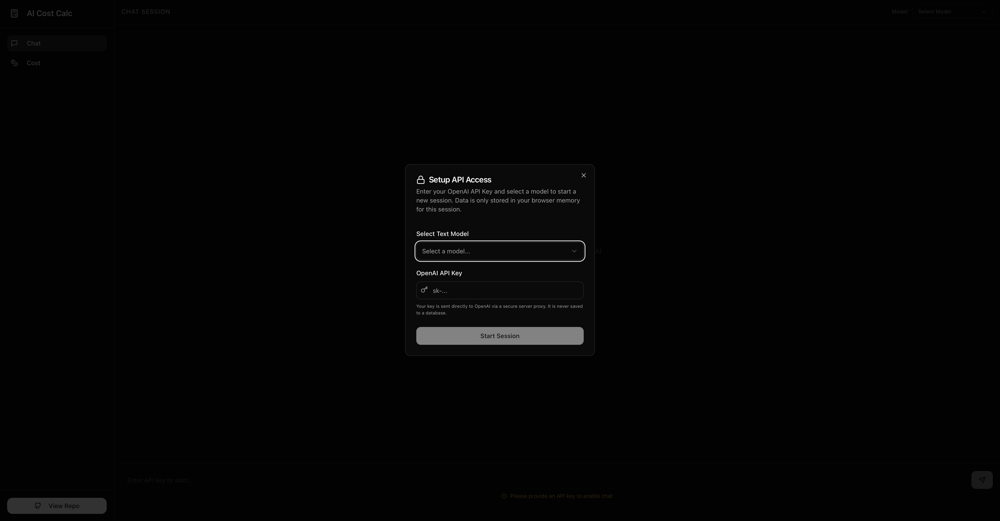
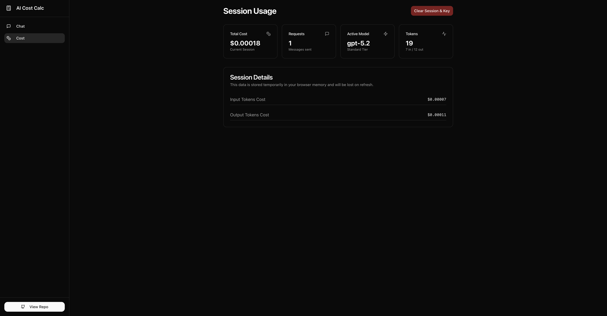

# ⚡️ TokenAudit
### Stateless, Privacy-First Cost Tracking for LLM Inference


## Interface

## Interface

<div align="center">
  <div>
    
    <p><em>1. Secure API Setup & Model Selection</em></p>
  </div>
  <br/>
  <div style="display: flex; gap: 20px; justify-content: center; align-items: flex-start;">
    <div style="width: 45%;">
      
      <p><em>2. Chat Interface & Model Settings</em></p>
    </div>
    <div style="width: 45%;">
      
      <p><em>3. Real-time Cost Telemetry</em></p>
    </div>
  </div>
</div>

## The Why
Developers often need to prototype with high-end models (GPT-4o, o1) but lack visibility into the compounding costs of long sessions. **TokenAudit** solves this by providing:
1.  **Real-time Cost telemetry**: Tracks input/output tokens per turn with calculating running totals.
2.  **Privacy by Design**: API keys are held transiently in the client; the server acts as a blind proxy.
3.  **No Database**: Zero setup. State is managed entirely in compliance-friendly session memory.

## Architecture
Designed as a lightweight, drop-in tool for development teams.
-   **Frontend**: React + Vite + Shadcn/UI for a high-performance, accessible interface.
-   **Backend**: Express.js proxy to sign requests without exposing keys to the client logger.
-   **State Management**: React Context (`SessionProvider`) calculates costs client-side to reduce server load.
-   **Security**: `x-api-key` header injection ensures keys are never stored on disk.

## Quick Start

```bash
# 1. Clone
git clone https://github.com/yourusername/token-audit.git

# 2. Install
npm install

# 3. Run
npm run dev
```

## Features
-   **Model-Aware Pricing**: Dynamically switches pricing logic based on selected model (e.g., GPT-4o vs O1 vs Mini).
-   **Context-Aware Chat**: Preserves full conversation history in-memory for accurate token counting.
-   **Zero-Config**: No auth, no database, no migrations. Just run and query.

## Tech Stack
-   **Core**: TypeScript, Node.js, React
-   **UI**: TailwindCSS, Shadcn/UI, Lucide Icons
-   **Routing**: Wouter (Minimalist router)
-   **Build**: Vite + ESBuild
